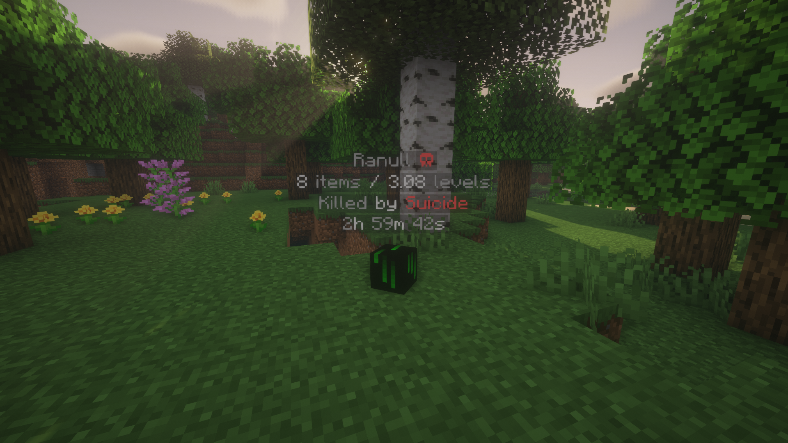

# Acknowledgement
This plugin was made by Ranull, and imported via his [GitLab repository](https://gitlab.com/ranull/minecraft/graves). As it wasn't updated in nearly 2 years, and no official source for a minecraft 1.20.2 and higher version, I decided to fork it and keep it alive (😁 pun intended!).

Original code was released under GPLv3. So everything will be kept under the same license here.

# What is it?

The **ULTIMATE** full-featured lightweight death chest plugin / player grave plugin! Every feature you could ever need and more! While still being lightweight and efficient.

## Top Features
* Customizable
* Schematics
* Economy
* Regions
* Placeholders
* Protection
* Zombies
* Corpses
* Models
* Obituary
* Compass
* Head Drops
* Holograms
* Particles
* Tokens
* Blacklisting
* Reload Safe

## Supports
* 1.7.\*, 1.8.\*, 1.9.\*, 1.10.\*, 1.11.\*, 1.12.\*, 1.13.\*, 1.14.\*, 1.15.\*, 1.16.\*, 1.17.\*, 1.18.\*, 1.19.\*, 1.20.\*
* Spigot, Paper, Purpur, Airplane, Pufferfish, Tuinity, CraftBukkit, CatServer, Mohist, Magma, MultiPaper
* GeyserMC (Bedrock Players)
* Forge/Bukkit Hybrid servers (Mohist, Magma, CatServer)

## Integrations
* Vault (Economy)
* WorldEdit (Schematics)
* WorldGuard (Flags)
* PlaceholderAPI (Placeholders)
* FurnitureLib/DiceFurniture (Furniture)
* FurnitureEngine (Furniture)
* ItemsAdder (Furniture/Blocks)
* Oraxen (Furniture/Blocks)
* ChestSort (Sorting Grave)
* ProtectionLib (Protected Region Detection)
* PlayerNPC (Corpses)

* Towny
* GriefDefender
* ItemBridge
* MineDown
* MiniMessage

## Screenshots

## Videos

**Video by:** _ServerMiner_

## Commands
| Command                                           | what does it do?             |
|---------------------------------------------------|------------------------------|
| **/graves**                                       | Player graves                |
| **/graves help**                                  | Plugin info                  |
| **/graves list** _{player}_                       | List another players graves. |
| **/graves givetoken** _{player} {token} {amount}_ | Give grave token (OP)        |
| **/graves dump**                                  | Dump server information (OP) |
| **/graves debug** _{level}_                       | Change debug level (OP)      |
| **/graves reload**                                | Reload command (OP)          |

## Permissions

    graves.place (Default)
    graves.open (Default)
    graves.break (Default)
    graves.teleport (Default)
    graves.experience (Default)
    graves.autoloot (Default)
    graves.gui (Default)
    graves.gui.other (OP)
    graves.givetoken (OP)
    graves.bypass (OP)
    graves.reload (OP)

## Bug Reports
If you find bugs please report them [here](https://github.com/svaningelgem/graves/issues).

## Usage

## Links
- **Spigot**: https://www.spigotmc.org/resources/graves.116202/
- **bStats**: https://bstats.org/plugin/bukkit/AvarionGraves/21607
- **GitHub**: https://github.com/AvarionMC/graves
